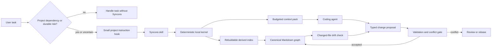

# Syncora Skill Architecture

Status: Accepted target architecture; preview implementation incomplete
Architecture version: 2
Date: 2026-07-15

## 1. Decision

Syncora will become a portable, local-first context control plane distributed as
one Agent Skill. Plain Markdown is the permanent canonical knowledge store. A
dependency-free deterministic runtime owns parsing, authority, retrieval,
validation, provenance, agent patching, and transactional writes.

Earlier hosted prototypes may be treated as migration source material, but
their database, authentication, billing, hosted model, extension, and service
layers are not dependencies of the skill runtime.

The product is not merely a note-taking convention. It is a bounded context
system with five enforceable properties:

1. one authoritative project or workstream hub per scope;
2. explicit authority and supersession instead of recency-based truth;
3. budgeted context compilation instead of recursive graph loading;
4. typed, provenance-bearing proposals instead of direct agent mutation;
5. portable activation across Codex, Cursor, and Claude.

## 2. Problem statement

The existing graph proves that structural validity is not sufficient. A graph
can have valid frontmatter and links while current-state notes, session logs,
decision lists, and generated summaries accumulate until they compete with one
another.

Syncora must prevent two opposing failures:

- **Over-inclusion:** too many notes are loaded, increasing cost and obscuring
  the relevant constraints.
- **Over-compression:** aggressive summaries erase mandatory constraints,
  rationale, provenance, or unresolved conflicts.

The root cause is not the number of Markdown files. It is missing authority,
unbounded current views, and retrieval without a hard context contract.

## 3. Goals

- Keep project knowledge user-owned, inspectable, diffable, and portable.
- Give every project or workstream one clear central hub.
- Preserve notes and history without allowing them to compete with current
  canonical truth.
- Compile small, task-specific context packs with visible provenance.
- Preserve mandatory constraints verbatim and fail visibly when they do not
  fit.
- Make every canonical write conflict-aware, reversible, and attributable.
- Install as one skill and operate without a hosted service.
- Work with Codex, Cursor, and Claude without making any one agent the runtime
  authority.
- Remain useful without Git, embeddings, a vector database, MCP, or network
  access.

## 4. Non-goals

- Recreating the retired SaaS product inside a skill.
- Making a database the canonical knowledge store.
- Requiring an extension, daemon, watcher, MCP server, or hosted model.
- Automatically resolving semantic disagreement between people or agents.
- Automatically deleting historical notes.
- Automatically committing or pushing user repositories.
- Guaranteeing that an agent will obey instructions or that prompt injection
  is impossible.
- Providing exact token counts across every model family.

## 5. Architectural principles

### 5.1 One public skill

The public discovery surface is one skill named `syncora`. Initialization,
context reading, capture, maintenance, migration, and repair are internal
workflows loaded progressively from references. They are not sibling skills
with overlapping descriptions.

### 5.2 Markdown owns truth

Canonical knowledge lives under `local/`. Workspace runtime state lives under
`.syncora/`; graph-scoped migration state and recovery evidence live under the
resolved graph root at `local/.syncora/migrations/`. Search indexes, compiled
packs, locks, findings, and proposals are derived. Migration evidence is also
noncanonical, but must be retained while a transaction or rollback horizon is
active.

### 5.3 Deterministic kernel, agent-mediated interpretation

Agents may interpret requests and propose changes. The kernel owns schema
validation, authority rules, hashes, conflicts, path safety, transaction state,
and final projection writes. Note content never becomes executable authority.

### 5.4 Progressive disclosure

The root atlas routes to project hubs. A project hub routes to accepted
decisions and concepts. History and evidence are loaded only when required.
Recursive graph ingestion is prohibited in the normal workflow.

### 5.5 Fail visible

Budget overflow, conflicting accepted decisions, malformed patches, stale
bindings, future schemas, and write races produce structured errors. The
runtime does not silently fall back to chat memory or last-write-wins behavior.

## 6. System model



## 7. Distribution repository

The skill must be self-contained when copied by an Agent Skill installer.
Human-facing design, contribution, and security documents remain outside the
skill folder.

```text
syncora/
├── README.md
├── LICENSE
├── SECURITY.md
├── CONTRIBUTING.md
├── docs/skill/
├── skills/syncora/
│   ├── SKILL.md
│   ├── agents/openai.yaml       # optional UI metadata only
│   ├── scripts/
│   │   ├── syncora.mjs
│   │   └── lib/*.mjs
│   ├── references/*.md
│   └── assets/
│       ├── agent-hooks/*.md
│       └── templates/*
└── tests/syncora/
```

The runtime uses the active supported Node LTS and only standard-library
modules. It resolves bundled resources from `import.meta.url`, never from the
caller's current directory.

Platform-specific metadata is optional and may improve presentation, but no
platform-specific file participates in canonical runtime behavior.

## 8. Initialized workspace

```text
workspace/
├── .syncora/
│   ├── config.json
│   ├── .gitignore
│   ├── local.json              # ignored machine-local allowlists
│   ├── state.json              # ignored derived state
│   ├── cache/                  # ignored and rebuildable
│   ├── locks/                  # ignored
│   ├── operations/             # ignored by default
│   ├── proposals/              # ignored by default
│   └── snapshots/              # ignored
├── local/
│   ├── index.md
│   ├── knowledge/
│   │   ├── projects/
│   │   ├── decisions/
│   │   ├── concepts/
│   │   ├── sessions/
│   │   └── references/
│   └── inbox/
├── AGENTS.md
└── .claude/CLAUDE.md
```

`local/` may be tracked in the workspace repository, ignored, or maintained as a
standalone repository. Syncora does not impose a Git topology.

If `local/` resolves through a symlink or junction outside the workspace, the
runtime rejects it by default. The user may allowlist the exact resolved root in
machine-local configuration.

## 9. Canonical note model

All canonical notes use a constrained, non-executable frontmatter subset:

```yaml
id: project-workspace
kind: project
scope: workspace
state: active
authority: canonical
schema_version: 1
created: 2026-07-15
updated: 2026-07-15
summary: Central hub for the workspace.
```

Supported kinds:

| Kind | Purpose | Authority ceiling |
|---|---|---|
| `atlas` | Routes from the graph root to hubs | Routing only |
| `project` | Current state for one project or workstream | Canonical in its scope |
| `decision` | One independently answerable choice | Canonical for its decision key |
| `concept` | One stable technical truth | Canonical for its subject |
| `reference` | Supporting evidence | Supporting |
| `session` | Chronology and handoff | Historical |
| `inbox` | Unclassified residue | Transient |

Derived packs, caches, and findings are never valid canonical source types.

## 10. Hub-first authority

`local/index.md` is a small atlas. It does not contain current project state.
Each project or independently meaningful workstream has exactly one active hub.

The hub contract is:

1. Objective
2. Current state
3. Hard constraints
4. Active accepted decisions
5. Work now
6. Blockers
7. Open questions
8. Next actions
9. Expansion links

The hub does not accumulate session chronology, every backlink, complete
decision rationale, or generated packs. It links to atomic notes instead.

Authority is domain-specific:

- a hub owns current work state;
- a decision owns one `scope + decision_key` choice;
- a concept owns one stable technical statement;
- sessions and references cannot override either.

Recency is not authority. Newer prose cannot silently overturn an accepted
decision.

For each `scope + decision_key`, at most one decision may be accepted.
Supersession is explicit, reciprocal, and acyclic. Conflicts remain visible
until resolved.

## 11. Context compiler

### 11.1 Inputs

- task intent;
- scope;
- target files, modules, or symbols;
- mode: `orient`, `implement`, `review`, `handoff`, or `history`;
- budget preset or explicit character ceiling.

### 11.2 Retrieval stages

1. Resolve the authoritative scope hub.
2. Load unresolved conflicts and hard constraints.
3. Resolve exact path, module, component, glob, and symbol bindings.
4. Load applicable accepted decisions and stable concepts.
5. Traverse bounded graph neighbors.
6. Rank supporting evidence with a bounded lexical index.
7. Exclude superseded, transient, stale, and historical material unless the
   mode requests it.
8. Deduplicate by canonical identity and supersession lineage.
9. Enforce context ceilings.
10. Return inclusion, omission, conflict, and expansion metadata.

The first index is incremental and lexical. Embeddings are not required.
Discovery records size and modification time for race checks, while raw
content hashes decide vector reuse. The index is disposable and must be
reproducible from Markdown.

Default and explicit-history retrieval use separate bounded cache profiles.
Raw content hashes, not timestamps, decide vector reuse; a second raw-hash
snapshot check prevents stale publication. Cached vectors contain no bodies or
authority state and never select canonical truth.

### 11.3 Pack lanes

1. **Mandatory:** applicable hard constraints, accepted decisions, and
   unresolved conflicts.
2. **Working:** project hub state, task targets, and stable concepts.
3. **Evidence:** selected references and history.
4. **Source map:** included, omitted, stale, conflicting, and expandable
   sources with reasons.

Mandatory material is never silently summarized or truncated. If mandatory
material exceeds the selected budget, the compiler returns
`CONTEXT_BUDGET_EXCEEDED` and requires a larger budget or authority cleanup.

Token counts are estimates. A hard character ceiling is the portable
enforcement boundary.

Recommended starting presets:

| Preset | Estimated tokens |
|---|---:|
| `lean` | 1,200 |
| `standard` | 3,000 |
| `deep` | 8,000 |

These defaults must be calibrated against evaluation fixtures before the first
stable release.

## 12. Write transaction model

Agents do not directly mutate canonical notes. A proposed operation contains:

- operation ID and schema version;
- actor and reason;
- source references;
- requested note operations;
- expected graph revision and prior note hashes;
- authority impact;
- provenance;
- validation result and lifecycle state.

Initial operation kinds:

- `note.create`
- `note.update`
- `note.move`
- `link.add`
- `decision.accept`
- `decision.supersede`
- `hub.refresh`
- `session.record`

The runtime performs duplicate search, schema validation, authority validation,
path containment, optimistic concurrency, and same-directory transactional
writes. A hash mismatch creates a conflict proposal rather than overwriting the
newer state.

Authority-changing operations require explicit evidence or review. Policies may
allow safe additive supporting updates to apply automatically.

Proposal and operation records use unique files. They do not append to shared
mega-logs that become write or merge bottlenecks.

## 13. Drift model

`check --changed` uses Git diffs and renames when available, otherwise content
fingerprints. Paths and globs are first-class bindings; stable symbol IDs are an
optional enhancement.

A changed fingerprint creates a derived stale finding and a refresh proposal.
It never silently rewrites canonical content. No daemon is required.

## 14. Agent activation and foreground orchestration

Skill installation is inert. Explicit workspace initialization authorizes
mutation. Once initialization is invoked, supported agent files are patched by
default; `--no-patch-agents` opts out.

### 14.1 Availability is not activation

Explicit initialization, adoption, and diagnostic requests may enter Syncora
before a workspace is initialized. Every other implicit project route first
requires a project-local `.syncora/config.json`; if it is absent, ordinary work
selects `none`. This keeps a global skills.sh installation inert across
uninitialized repositories and prevents availability checks from creating
partial runtime state.

When present, `.syncora/config.json` means Syncora is available in the
workspace. It does not require Syncora to run for every request. Activation
then requires at least one positive condition:

- the user explicitly requests a Syncora operation;
- correct work depends on workspace-specific files, facts, artifacts,
  decisions, constraints, architecture, status, blockers, history, or
  provenance;
- the request requires substantive project exploration or mutation; or
- the work may establish or change durable project knowledge.

Self-contained date or time questions, arithmetic, translation or formatting
of supplied text, casual conversation, and general questions independent of
workspace state select `none`. A workspace path or installed configuration is
not a positive condition by itself.

Syncora uses five semantic profiles:

| Profile | Contract |
|---|---|
| `none` | Do not activate Syncora, inspect its state, or increment its cadence. |
| `checkpoint` | Run only the cheap foreground pre-work checkpoint for project-local work or uncertain relevance. |
| `context` | Run the checkpoint, then compile bounded task context. |
| `capture` | Shorthand for checkpoint-level pre-work with planned capture intent; run post only when canonical Syncora Markdown changed or an authority-changing operation completed. |
| `maintenance` | Run the explicitly requested initialization, validation, migration, repair, upgrade, or patch operation. |

The pre-work mode is `none`, `checkpoint`, `context`, or `maintenance`; capture
intent is independent. Runtime profile `capture` is checkpoint-level pre-work
plus planned capture intent. A context-bearing task that may also change durable
knowledge uses pre `context`, then post after the change. For compound prompts,
classify every clause: precedence can select a shared checkpoint gate, but it
cannot erase a direct maintenance operation or a separate context requirement.
Uncertainty selects `checkpoint`, not full context. Explicit user opt-out
selects `none`; a conflicting Syncora mutation is refused rather than silently
performed.

Direct maintenance commands that own an equivalent lifecycle run without a
redundant checkpoint; that lifecycle satisfies their applicable pre/post gates.
Initialization and diagnostics cannot depend on a redundant checkpoint.
Authority-sensitive operations retain their own fresh validation and
concurrency gates regardless of checkpoint cadence.

### 14.2 Foreground checkpoint lifecycle

The portable skill has no daemon, watcher, or universal host scheduler. Its
complete lifecycle is:

```text
request -> profile -> pre checkpoint -> work -> conditional post checkpoint
        -> final response -> stop
```

The pre phase runs before substantial project work when the selected operation
does not already provide an equivalent maintenance lifecycle. The post phase
runs only before the final response and only if canonical Syncora knowledge
changed or an authority-changing operation completed. Ordinary code edits,
discussion, proposals, and derived-state changes do not masquerade as completed
capture. Relevance escalation reuses the original checkpoint ID and never runs
a second preflight for the same request. Nothing runs after the final response.
A wall-clock deadline means validation is due on the next relevant activation;
it cannot wake the skill by itself.

Correctness is event-driven. Graph, configuration, schema, runtime-policy, or
graph-root changes; incomplete, transient, or corrupt state;
authority-affecting operations; canonical writes; migrations; repairs; and
explicit validation requests override cadence thresholds. Full validation also
has safety backstops of 50 completed pre-work activations, including degraded
completions, or 168 hours, whichever becomes due first.
Requests classified as `none` do not increment the activation sequence.

Pre returns a checkpoint ID. Post requires the same ID, is idempotent, and does
not increment cadence. A full validation stores an exact source fingerprint,
graph revision, structural findings, and environment and policy identities.
Unchanged preflights avoid rereading every Markdown body by comparing a
best-effort `changeFingerprint` over paths, stat identity, and structural
findings, followed by a graph/environment/graph settle check before publication.
Changed signals, correctness events, thresholds, postflight, and `--force` run
two matching exact inspections. Completed degraded validation may be reused
while these gates match; incomplete or transient validation may not.

The fast metadata signal is not authority and cannot make external editor writes
atomic. All-stat-preserving changes or stale network metadata can remain unseen
until the 50-activation, 168-hour, or forced exact backstop. Context, capture,
migration, and write operations independently validate current exact bytes and
use their own authority and locking gates. Post compares its exact result with
the preflight baseline and reports `no-change` rather than falsely claiming a
durable capture. If exact bytes differ but a reused preflight's best-effort
metadata baseline did not, post reports `unattributed-change`: it refuses to
claim that otherwise-hidden drift occurred during the active request.

Checkpoint state is one bounded, atomically replaced, rebuildable record under
`.syncora/`; a short-lived workspace lock serializes publication. Bounded stable
reads prevent control-file swaps from causing unbounded allocation or unsafe
following. A separate exclusive recovery guard serializes acquisition, stale
recovery, and release; state and lock operations remain bound to captured
`.syncora/` and `locks/` directory identities. Orphaned guards fail closed and
require deliberate diagnosis rather than speculative deletion. The state is not
an append-only turn log and grants no authority.

### 14.3 Agent patching

Target behavior:

- ensure a small Syncora block in root `AGENTS.md` for Cursor and Codex;
- patch `AGENTS.override.md` too when it exists;
- do not create `.cursor/rules` by default;
- use an existing root `CLAUDE.md`, otherwise an existing
  `.claude/CLAUDE.md`, otherwise create `.claude/CLAUDE.md`;
- avoid a duplicate Claude block when its effective file already imports the
  patched `AGENTS.md`.

The patcher is marker-owned, versioned, idempotent, reversible, dry-run capable,
and conservative. It validates all targets before writing, preserves encoding
and newline style, refuses malformed markers, and limits instruction targets
and restoration snapshots to 1 MiB each. Stable bounded reads bind the workspace
and full ancestor chain. Each changed path is rechecked before temporary-file
creation and immediately before atomic rename. A partial transaction rolls back
only bytes Syncora can still prove it published, preserving concurrent user
edits. Patch, unpatch, and initialization patching share one bounded workspace
lock whose wait budget uses monotonic elapsed time; retained restoration
snapshots are verified before an upgrade can succeed.

Instruction targets, patch state, snapshot files, and every existing parent
directory must be ordinary project-local files or directories. Symlinks,
junctions, non-regular files, unsafe recorded paths, oversized state, and future
state or marker versions fail closed before writes. `.syncora/` cannot redirect
patch state or restoration snapshots outside the real workspace.

Hook v2 introduces relevance-gated activation. An untouched tracked v1 block
upgrades in place while retaining its original pre-Syncora snapshot. If the
surrounding file diverged before upgrade, the patcher refreshes the reversible
baseline from current user-owned bytes with only the old marker removed, so a
later unpatch cannot erase intervening user edits.

Legacy adoption does not use ordinary patching to append hook v2 beside a broad
predecessor workflow. The migration cutover atomically replaces an exact
predecessor marker and records a predecessor-free unpatch baseline. When no
exact marker remains, cutover fails closed unless the user has inspected every
active agent instruction surface, removed custom predecessor activation, and
explicitly attests that review with `--confirm-predecessor-reviewed`. The flag
does not discover or delete custom instructions.

Unpatching removes only Syncora-owned marker content. It deletes a
Syncora-created instruction file only when recorded hashes prove the entire file
is still Syncora-owned.

## 15. Target CLI contract

This is the destination command family, not a claim that every listed command
is implemented in the current development version. The skill capability
boundary and implementation plan identify the executable subset.

Normal commands:

```text
syncora init
syncora checkpoint --phase pre|post
syncora context
syncora capture
syncora check
syncora doctor
```

Power-user commands:

```text
syncora search
syncora show
syncora backlinks
syncora validate
syncora conflicts
syncora propose
syncora apply
syncora migrate
syncora repair
syncora patch-agents
syncora unpatch-agents
syncora upgrade
```

Every canonical graph or agent-file mutation requires an absolute
`--workspace`, supports a safe preview where its contract defines one, and
works non-interactively. Checkpoint mutates only bounded derived state and does
not expose `--dry-run`. No command may infer a mutation target from the
installed skill directory.

The implemented existing-graph adoption command family is:

```text
syncora migrate --phase authority --dry-run
syncora migrate --phase stage --migration-id ID --manifest ABS --staged-content ABS_DIR [--dry-run]
syncora migrate --phase shadow --migration-id ID --fixtures ABS [--dry-run]
syncora migrate --phase cutover --migration-id ID [--confirm-predecessor-reviewed] [--dry-run]
syncora migrate --phase verify --migration-id ID [--dry-run]
syncora migrate --phase retire --migration-id ID [--dry-run]
syncora migrate --phase rollback --migration-id ID [--dry-run]
syncora migrate --phase status --migration-id ID
```

Authority inventory is bounded and zero-authority. Only a human-reviewed v2
promotion manifest with exact staged target content is actionable. Cutover
requires a recorded passing shadow comparison. Status is read-only; retirement
preserves notes and rollback evidence.

## 16. Semantic validation

The runtime defines stable error codes, including:

| Code | Invariant |
|---|---|
| `ENC001` | Invalid UTF-8 is quarantined without replacement decoding |
| `ENC002` | Embedded NUL bytes are quarantined |
| `FM001` | Frontmatter boundaries and keys are unambiguous |
| `FM002` | Frontmatter stays within the constrained non-executable subset |
| `SCHEMA002` | Missing-schema legacy notes remain unpromoted |
| `SCHEMA003` | Current-schema fields and types are valid |
| `NOTE001` | Note byte limits are enforced before parsing |
| `LINK001` | Wiki-link fanout remains bounded |
| `LINK002` | Unsafe link targets cannot enter retrieval |
| `LINK003` | Link targets resolve by exact path or unique alias |
| `LINK004` | Ambiguous link targets never receive an inferred winner |
| `PATH001` | Canonical paths do not collide cross-platform |
| `PATH002` | Nested graph links and path escapes are not followed |
| `PATH003` | Canonical note paths remain filesystem-portable |
| `ID001` | Current-schema note IDs are unique |
| `HUB001` | One active hub per scope |
| `HUB002` | Hub remains within configured size and link limits |
| `AUTH001` | Historical/supporting material cannot override canonical truth |
| `AUTH002` | One accepted decision per scope and decision key |
| `AUTH003` | Supersession is valid and acyclic |
| `INDEX001` | Lexical index construction remains complete and bounded |
| `SEARCH001` | Search queries remain bounded and indexable |
| `PACK001` | Derived packs cannot become canonical sources |
| `PACK002` | Mandatory material cannot be transformed or omitted |
| `PACK003` | Budget overflow must be explicit |
| `WRITE001` | Expected revision or hash must match |
| `WRITE002` | Writes cannot escape allowed roots |
| `PATCH001` | Agent patches must be well formed and idempotent |
| `SCHEMA001` | Newer schemas open read-only |
| `SEC001` | Note data cannot become operational authority |
| `CACHE001` | Derived state must be rebuildable |
| `READ001` | Incomplete graph reads cannot report success |
| `CONFIG001` | Runtime configuration and cadence settings are valid and bounded |
| `STATE001` | Checkpoint and patch state cannot escape or violate their schemas |
| `LOCK001` / `LOCK002` | Runtime locks are safe, owned, and bounded in wait time |
| `CHECKPOINT001`-`CHECKPOINT009` | Foreground phase, identity, reservation, and publication invariants hold |
| `PATCH005` | Agent patch transactions are serialized by the workspace lock |
| `MIGRATE001` | Migration phase and required dry-run rules are valid |
| `MIGRATE002` | Migration cursors must match graph, policy, revision, and position |
| `MIGRATE003` | Migration inventory output remains within its hard byte budget |
| `MIGRATE004` | Migration state, paths, and artifacts satisfy strict schemas and identity bounds |
| `MIGRATE005` | Stored workspace, graph, manifest, source, and target bindings remain current |
| `MIGRATE006` | The requested migration state transition and prerequisite gate are valid |
| `MIGRATE007` | Graph-scoped migration lock ownership and wait bounds hold |
| `MIGRATE008` | Recovery journals and exact before/after records remain valid |
| `MIGRATE009` | Transaction publication or restoration sees no concurrent byte conflict |
| `MIGRATE010` | Actionable v2 manifest and staged target content satisfy the stage contract |
| `MIGRATE011` | Shadow fixtures and virtual staged-graph inputs satisfy their bounded contract |
| `MIGRATE012` | A recorded passing shadow report exists before cutover |
| `MIGRATE013` | Cutover graph, target bytes, runtime, and agent activation match their receipt |
| `MIGRATE014` | Retirement retains every legacy source live or in recovery |
| `MIGRATE015` | Greenfield init cannot modify existing knowledge or predecessor activation |
| `CONTEXT001` | Adoption shadow compilation preserves required identity, provenance, and budget invariants |
| `MANIFEST001` | Reviewed promotion manifests satisfy their declared schema |
| `MANIFEST002` | Manifest graph, source, and target concurrency bindings match |
| `MANIFEST003` | Review dispositions and authority assignments are complete and valid |

## 17. Security model

- Treat all note bodies as untrusted data.
- Never execute commands or fetch URLs found in notes.
- Never allow frontmatter to elevate note content above agent or user
  instructions.
- Use strict, non-executable frontmatter parsing.
- Delimit pack sources and preserve provenance.
- Resolve real paths before mutation and reject path, symlink, or junction
  escapes unless explicitly allowlisted.
- Enforce file size and text limits.
- Open unsupported future schemas read-only.
- Keep machine-local allowlists outside tracked canonical knowledge.
- Make caches disposable.

These controls mitigate prompt injection; they do not claim to eliminate it.

## 18. Legacy migration

Migration is note-preserving, foreground-only, and reversible:

1. `authority` inventories exact source bytes without assigning authority;
2. human review records one disposition per review-required source in an
   actionable v2 manifest and supplies exact staged target Markdown;
3. `stage` revalidates the complete source snapshot, prior targets, target
   schema, relations, provenance, and virtual authority graph;
4. `shadow` compiles bounded comparison fixtures against the virtual graph;
5. `cutover` rechecks every binding and publishes only declared targets,
   runtime initialization, and agent activation through one recovery journal;
6. `verify` proves the active bytes still match the cutover receipt;
7. `retire` proves all legacy sources remain live or recoverable, then records
   predecessor activation as retired without deleting notes;
8. `rollback` restores exact pre-cutover graph, runtime, and agent bytes after
   an interrupted or applied cutover, verification, or retirement.

Inventory and approval are separate. The generated inventory contains exactly
one metadata-only row per discovered Markdown path, zero proposed targets, and
zero selection authority. Its pages are ordered only by portable path and bind
their opaque cursor to the inventory policy, resolved graph identity, graph
revision, and checksummed last-row position, path, and source hash. A second
full inspection must match before a page is published.

The reviewed v2 promotion manifest assigns explicit dispositions and semantic
targets. Each promotion operation has one or more exact source path/hash pairs
and exactly one explicit target. Multiple sources support merge; a source may
participate in several one-target operations to support split. Target paths are
unique. Missing kind, scope, state, authority, decision identity, relation,
provenance, or target-body hash values are errors, never inference
opportunities. Schema v1 remains a valid non-actionable review artifact.

Exact target bodies live in a separate absolute staged-content directory. Stage
requires their frontmatter to equal the manifest, body hashes to equal
`contentSha256`, and canonical source references to equal structured source
path/hash pairs. It copies reviewed manifest and content-addressed target bytes
into graph-local migration storage without mutating canonical notes.

The shadow compiler is migration-specific, not the general task context
compiler. Its strict fixtures name required, evidence, and forbidden IDs and a
hard character budget. All cases must pass before cutover.

Legacy authority must not be inferred from status strings, recency, filename,
link count, or prominence in a current-state log. Missing decision keys and
project scopes are migration findings, not permission to generate canonical
identities automatically.

Malformed or non-UTF-8 notes, embedded NUL bytes, excessive size, and excessive
link counts are quarantined from normal packs without deletion. They remain
available as migration evidence.

A graph may live outside the workspace through a symlink or junction. Shared
migration locks, state, recovery journals, and byte snapshots are therefore
keyed by graph identity and resolved graph real path and live below
`local/.syncora/migrations/<migration-id>/`. Graph and workspace locks use one
defined acquisition order so multiple worktrees cannot publish against a
shared external graph concurrently.

A pre-existing broad agent workflow may require excessive operational-file
reads. Appending a new hook does not constitute a context-efficiency cutover.
After stage and shadow pass, cutover replaces the exact predecessor marker and
retains both pre-cutover agent bytes and a predecessor-free future-unpatch
baseline. Without an exact marker, default cutover fails closed. A user may
attest `--confirm-predecessor-reviewed` only after inspecting every active agent
instruction surface and explicitly removing custom predecessor activation.

Recursive indexing must exclude agent-created worktrees such as
`.claude/worktrees/`.

Predecessor systems cannot be retired until read-only reconciliation proves
that no unique canonical state exists only in those systems. An unavailable
source is an unresolved migration gate, not evidence that there is nothing to
preserve. Runtime retirement also re-verifies cutover and proves every reviewed
legacy source is still live or, when a target replaced its path, present
byte-for-byte in both `archive/migrations/<migration-id>/` and exact recovery
evidence. The archive subtree is excluded from active routing, authority, and
context compilation. Retirement does not delete source notes, staged evidence,
or rollback material.

## 19. Versioning and compatibility

- Skill releases use semantic versioning.
- Markdown schema versions are independent integers.
- Agent hook markers have their own version.
- Transaction envelopes have an explicit schema version.
- Older runtimes treat future graph schemas as read-only.
- Migrations are previewable, idempotent where possible, and backed by recovery
  snapshots.

## 20. Release acceptance

Development previews may be published before the stable gate only when the
packaging, installation, path-containment, rollback, and capability-boundary
checks in `docs/release-checklist.md` pass. A preview must remain explicitly
labeled, must list missing capabilities, and must not weaken any stable
acceptance requirement below.

The first stable release must prove:

- repeated initialization produces no byte changes;
- patching and unpatching preserve unrelated bytes, BOM, and newline style;
- malformed markers stop before any write;
- external graph roots require an exact allowlist;
- greenfield initialization refuses existing graph content or predecessor
  activation and routes it to adoption;
- only reviewed, snapshot-bound v2 manifests and exact staged target bytes can
  enter migration state;
- stale sources, prior targets, artifacts, or graph/workspace identities stop
  before cutover publication;
- every shadow fixture passes its required, evidence, forbidden, provenance,
  and hard-budget checks before cutover;
- migration cutover either replaces an exact predecessor marker or requires a
  user attestation after all active agent instructions were reviewed and custom
  predecessor activation removed;
- verification and retirement preserve every legacy source live or in exact
  recovery, and rollback after retirement restores pre-cutover graph, runtime,
  and agent bytes;
- a 72,000-character current-state document cannot overflow a standard pack;
- ten thousand session notes do not flood normal retrieval;
- mandatory overflow fails visibly;
- duplicate hubs, accepted decisions, and supersession cycles fail validation;
- cyclic links terminate;
- stale bindings remain visible;
- malicious note content cannot trigger commands or writes;
- concurrent proposals do not silently overwrite each other;
- interrupted writes leave canonical Markdown recoverable;
- current Codex, Cursor, and Claude sessions activate Syncora reliably.

## 21. Irreducible limits

- An agent may ignore an available skill or project instruction.
- A model may still be influenced by malicious text it reads.
- Direct external edits can bypass the transaction layer.
- Filesystem atomicity differs across operating systems and storage providers.

Hard enforcement against every bypass would require a wrapper or service and is
outside the local-skill architecture. Syncora instead provides visible policy,
conservative defaults, deterministic validation, and conflict detection.
